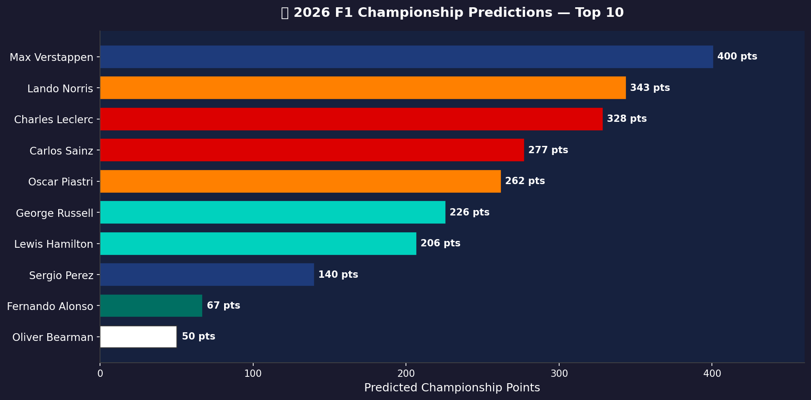
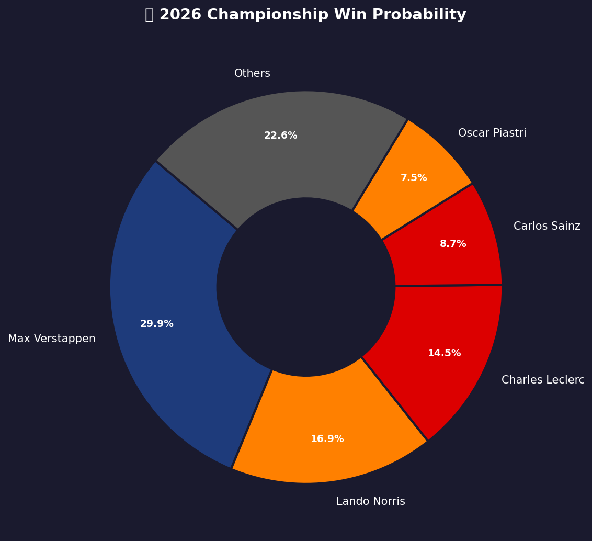
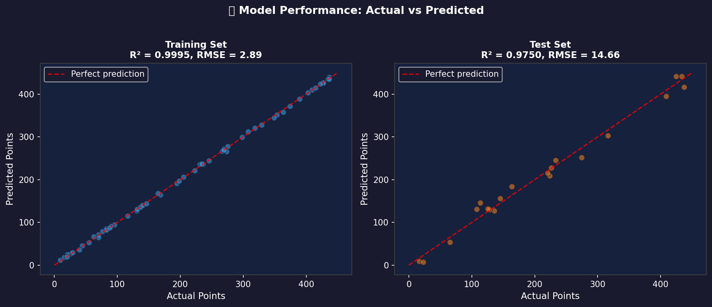
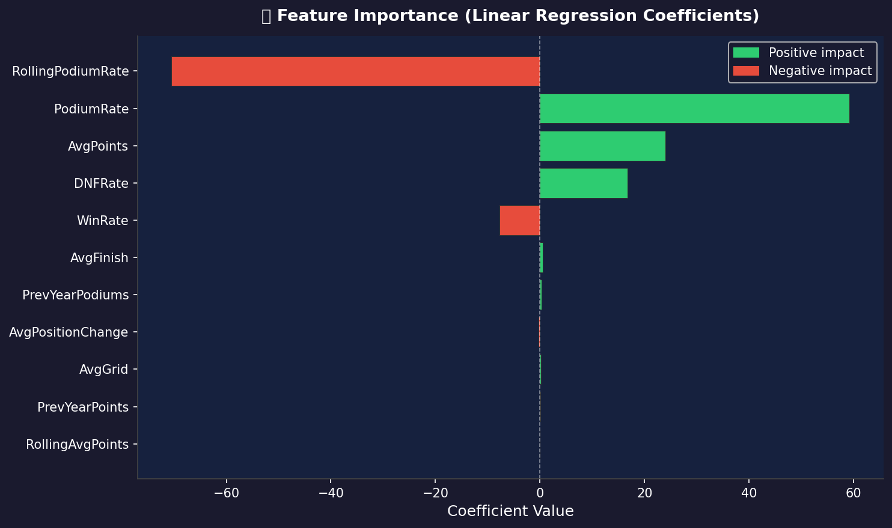

# F1 2026 Drivers' Championship Prediction

A machine learning project that predicts the 2026 Formula 1 Drivers' Championship using historical race data loaded via [FastF1](https://theoehrly.github.io/Fast-F1/) and a linear regression model.

---

## Table of Contents

- [Project Overview](#project-overview)
- [Results](#results)
- [Screenshots](#screenshots)
- [Project Structure](#project-structure)
- [Setup & Installation](#setup--installation)
- [Usage](#usage)
- [Model Details](#model-details)
- [Tech Stack](#tech-stack)

---

## Project Overview

**Goal:** Predict which driver will win the 2026 F1 Drivers' Championship based on historical performance features derived from 2023–2025 season data.

**Approach:**

1. Load historical F1 race results (2023–2025) via FastF1 API
2. Engineer per-driver performance features (win rate, podium rate, DNF rate, average finish, rolling averages, etc.)
3. Train a linear regression model on historical championship points
4. Predict 2026 championship points and rank all drivers

---

## Results

### 🏆 2026 Predicted Champion: **Max Verstappen**

| Pos | Driver          | 2026 Team       | Predicted Points | Win Probability |
| --- | --------------- | --------------- | ---------------- | --------------- |
| 1   | Max Verstappen  | Red Bull Racing | 400              | 29.9%           |
| 2   | Lando Norris    | McLaren         | 343              | 16.9%           |
| 3   | Charles Leclerc | Ferrari         | 328              | 14.5%           |
| 4   | Carlos Sainz    | Williams †      | 277              | 8.7%            |
| 5   | Oscar Piastri   | McLaren         | 262              | 7.5%            |
| 6   | George Russell  | Mercedes        | 226              | 5.2%            |
| 7   | Lewis Hamilton  | Ferrari †       | 206              | 4.3%            |
| 8   | Sergio Perez    | (Red Bull) ‡    | 140              | 2.2%            |
| 9   | Fernando Alonso | Aston Martin    | 67               | 1.1%            |
| 10  | Oliver Bearman  | Haas F1 Team    | 50               | 0.9%            |

**Notable 2026 driver moves (not reflected in training data):**

| Driver           | Previous Team | 2026 Team          |
| ---------------- | ------------- | ------------------ |
| Lewis Hamilton   | Mercedes      | Ferrari            |
| Carlos Sainz     | Ferrari       | Williams           |
| Kimi Antonelli   | — (rookie)    | Mercedes           |
| Liam Lawson      | RB            | Red Bull Racing    |
| Esteban Ocon     | Alpine        | Haas F1 Team       |
| Nico Hulkenberg  | Haas F1 Team  | Kick Sauber / Audi |
| Jack Doohan      | — (reserve)   | Alpine             |
| Franco Colapinto | Williams      | Alpine             |

> † Team label corrected to 2026 reality; model predictions are based on driver performance history (2023–2025) at their previous constructors.  
> ‡ Sergio Perez was replaced at Red Bull by **Liam Lawson** for 2026; his prediction reflects historical Red Bull-era performance.

> **Limitation:** The model predicts based on a driver's historical performance regardless of constructor change. Actual results may differ significantly when a driver switches to a weaker or stronger team.

### Model Performance

| Metric                    | Train          | Test      |
| ------------------------- | -------------- | --------- |
| R²                        | 0.9995         | 0.9750    |
| RMSE                      | 2.89 pts       | 14.66 pts |
| MAE                       | —              | 7.43 pts  |
| Cross-val R² (mean ± std) | 0.9935 ± 0.003 | —         |

The model achieves an **R² of 0.975 on the test set**, indicating strong predictive accuracy. The high training R² (0.9995) with good test performance confirms the model generalises well without significant overfitting.

### Top Feature Importances

| Feature           | Coefficient | Direction |
| ----------------- | ----------- | --------- |
| RollingPodiumRate | −70.49      | Negative  |
| PodiumRate        | +59.21      | Positive  |
| AvgPoints         | +23.94      | Positive  |
| DNFRate           | +16.71      | Positive  |
| WinRate           | −7.72       | Negative  |

> Note: Negative coefficients for rolling features vs positive for season-aggregate features reflect multi-collinearity in the linear model; the net effect of podium/win performance is strongly positive.

---

## Screenshots

### Championship Predictions — Top 10



### Win Probability Distribution



### Model Performance: Actual vs Predicted



### Feature Importance



---

## Project Structure

```
F1/
├── data/
│   ├── raw/                        # Raw FastF1 cached data
│   ├── processed/
│   │   └── driver_features.csv     # Engineered feature matrix
│   └── predictions/
│       ├── 2026_championship_predictions.csv
│       └── prediction_summary.txt
├── docs/
│   └── images/                     # README screenshots
├── models/
│   ├── feature_importance.csv      # Model coefficients per feature
│   └── model_metrics.csv           # Train/test performance metrics
├── notebooks/
│   ├── 01_data_exploration.ipynb
│   ├── 02_feature_engineering.ipynb
│   ├── 03_model_training.ipynb
│   └── 04_predictions.ipynb
├── src/
│   ├── data/
│   │   └── load_fastf1.py          # FastF1 data loading utilities
│   ├── features/
│   │   └── build_features.py       # Feature engineering pipeline
│   ├── models/
│   │   ├── train_model.py          # Model training script
│   │   └── predict.py              # Prediction script
│   └── visualization/
│       └── visualize.py            # Plotting utilities
├── requirements.txt
└── README.md
```

---

## Setup & Installation

### Prerequisites

- Python 3.9+
- pip

### 1. Clone the repository

```bash
git clone https://github.com/isthatpaul/F1.git
cd F1
```

### 2. Create and activate a virtual environment

```bash
# Windows
python -m venv .venv
.venv\Scripts\activate

# macOS / Linux
python -m venv .venv
source .venv/bin/activate
```

### 3. Install dependencies

```bash
pip install -r requirements.txt
```

---

## Usage

### Option A — Jupyter Notebooks (recommended)

Run the four notebooks in order:

| Notebook                                 | Purpose                                      |
| ---------------------------------------- | -------------------------------------------- |
| `notebooks/01_data_exploration.ipynb`    | Explore raw FastF1 data                      |
| `notebooks/02_feature_engineering.ipynb` | Build the driver feature matrix              |
| `notebooks/03_model_training.ipynb`      | Train & evaluate the linear regression model |
| `notebooks/04_predictions.ipynb`         | Generate 2026 championship predictions       |

```bash
jupyter lab
```

### Option B — Python scripts

```bash
# 1. Load and process data
python src/data/load_fastf1.py

# 2. Build features
python src/features/build_features.py

# 3. Train model
python src/models/train_model.py

# 4. Generate predictions
python src/models/predict.py
```

Predictions are saved to `data/predictions/2026_championship_predictions.csv`.

---

## Model Details

**Algorithm:** Linear Regression (scikit-learn `LinearRegression`)

**Target variable:** Season championship points

**Input features:**

| Feature             | Description                                  |
| ------------------- | -------------------------------------------- |
| `AvgPoints`         | Average points per race in the season        |
| `AvgFinish`         | Average finishing position                   |
| `AvgGrid`           | Average qualifying grid position             |
| `WinRate`           | Fraction of races won                        |
| `PodiumRate`        | Fraction of races with a podium finish       |
| `DNFRate`           | Fraction of races not finished               |
| `AvgPositionChange` | Average positions gained/lost vs grid        |
| `PrevYearPoints`    | Championship points from the previous season |
| `PrevYearPodiums`   | Podium count from the previous season        |
| `RollingAvgPoints`  | Rolling 3-season average points              |
| `RollingPodiumRate` | Rolling 3-season average podium rate         |

**Training data:** 2023–2025 F1 seasons

---

## Tech Stack

| Library                                        | Purpose                   |
| ---------------------------------------------- | ------------------------- |
| [FastF1](https://theoehrly.github.io/Fast-F1/) | F1 race data API          |
| [scikit-learn](https://scikit-learn.org/)      | Machine learning          |
| [pandas](https://pandas.pydata.org/)           | Data manipulation         |
| [numpy](https://numpy.org/)                    | Numerical computing       |
| [matplotlib](https://matplotlib.org/)          | Static visualisation      |
| [seaborn](https://seaborn.pydata.org/)         | Statistical visualisation |
| [plotly](https://plotly.com/python/)           | Interactive charts        |

---

_Predictions are based on historical data and statistical modelling — not a guarantee of future results._
